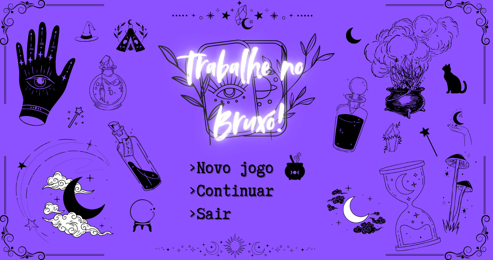

1. Qual o nome do projeto?
    - Trabalhe no Bruxó

2. Qual o tipo do projeto? É um jogo? Qual tipo de jogo?
    - É um jogo 2D de história baseado em rotas com uma mecânica de fusão de elementos.

3. Descreva o projeto em um parágrafo:
    - O jogo consiste numa visual novel cuja história segue uma rota diferente dependendo das suas escolhas. A história se passa numa loja de bruxa (que também é um brechó). Você joga como a estagiária da bruxa, atendendo clientes que querem ajuda mágica. Eles descrevem o problema e você precisa juntar os elementos corretos para criar uma poção que o resolva. As escolhas que você toma são baseadas no sucesso ou falha ao confeccionar essa poção.

4. Qual parte do projeto é especial?
    - A mecânica de fusão para criar novos elementos.

5. Poste telas de "screenshots" do projeto:
    - 
