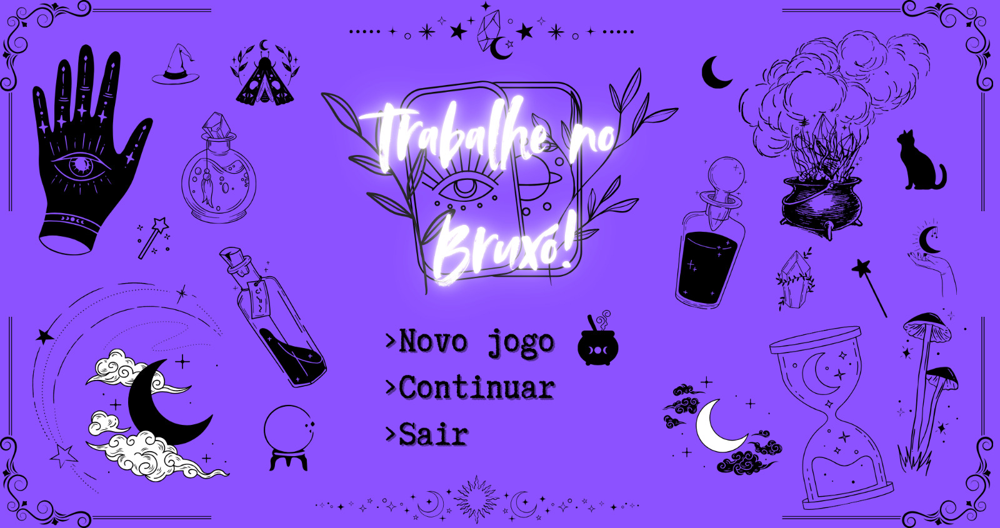

# Trabalhe no Bruxó

Esse projeto consiste num jogo 2D de história baseado em rotas com uma mecânica de fusão de elementos.

É uma visual novel cuja história segue uma caminho diferente dependendo das suas escolhas.

A história se passa numa loja de bruxa (que também é um brechó).
Você joga como a estagiária da bruxa, atendendo clientes que querem ajuda mágica.
Eles descrevem o problema e você precisa juntar os elementos corretos para criar uma poção que o resolva.
As escolhas que você toma são baseadas no sucesso ou falha ao confeccionar essa poção.

A parte especial do projeto é a mecânica de fusão para criar novos elementos.

Você pode achar mais informações sobre o projeto e o seu desenvolvimento [aqui](docs/).
