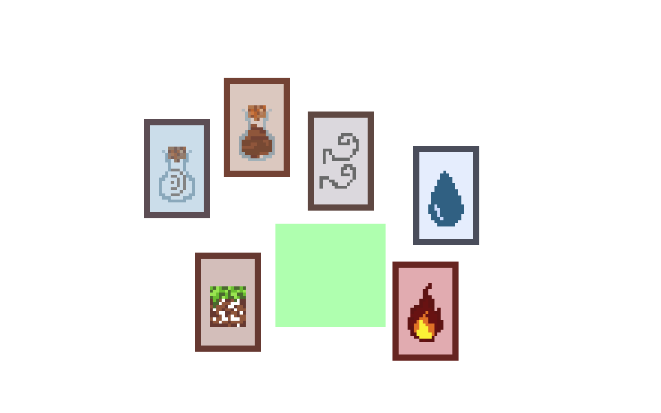
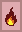
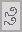
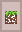
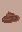
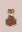
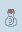
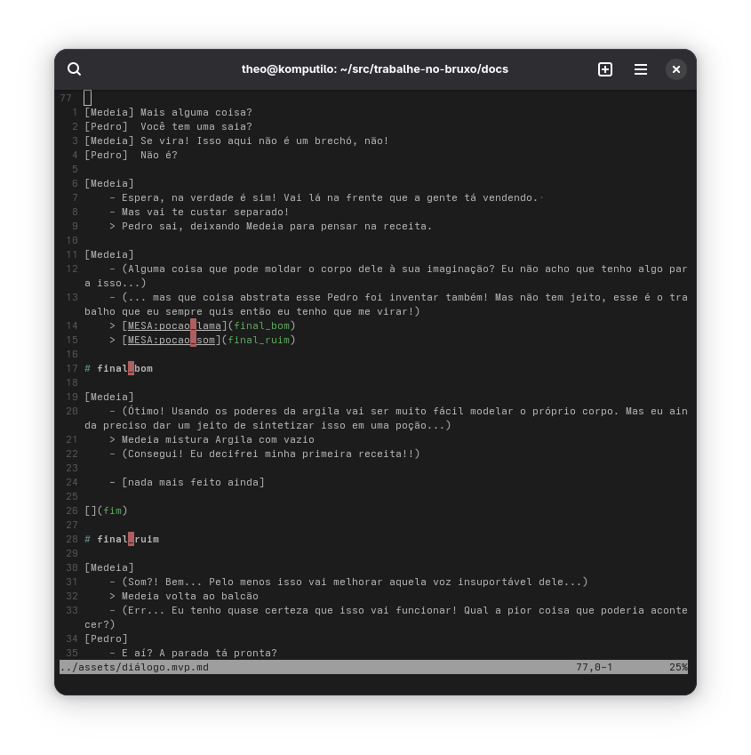
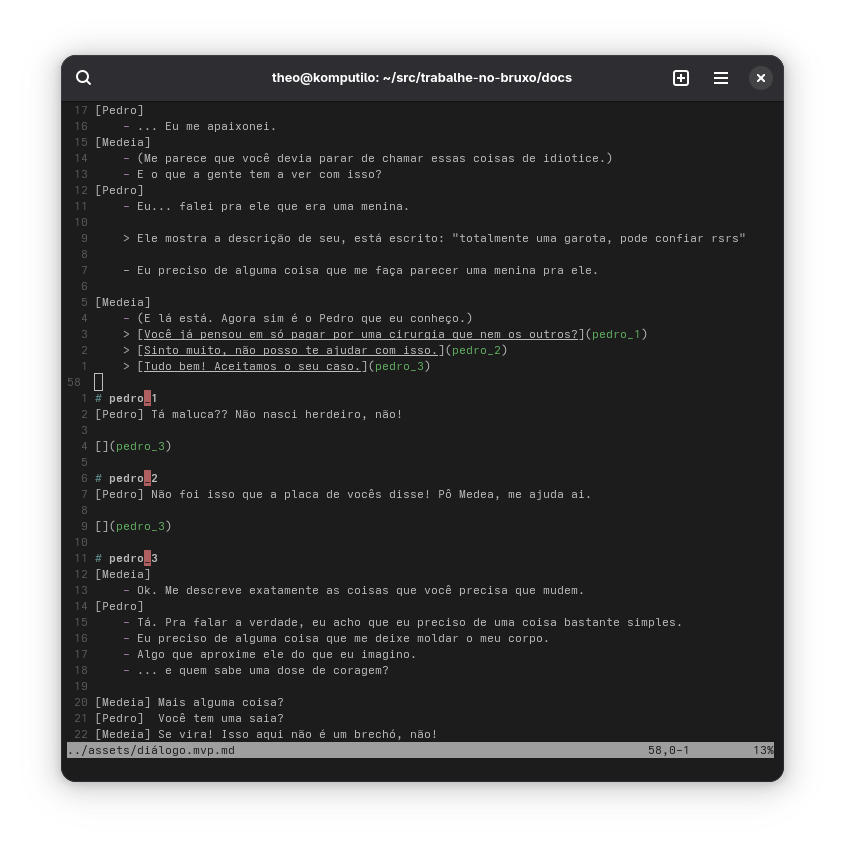
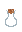

---
title: Trabalhe no Bruxó
subtitle: P6 - Estado final do processo
author: Rafaela Grillo & Theo Albuquerque & Yuri Sacksida
...

<!--
- em torno de 10 slides
- em torno de 10 minutos
- fazer demonstração do jogo

- [x] comparar expectativa inicial com o resultado final
- [ ] mostrar arquitetura geral
- [ ] mostrar 1 máquina de estados por participante
- [ ] mostrar trechos de código interessantes
-->

# Espectativas vs. Realidade

## Espectativas

- [ ] mecânicas básicas feitas:
    - [ ] mesclagem de cartas
    - [ ] diálogos visualizados com texto
    - [ ] diálogos visualizados com personagem
    - [ ] escolhas tomáveis com respostas nos diálogos
    - [ ] escolhas tomáveis com criação de poções nos diálogos
- [ ] conteúdo básico feito:
    - [ ] diálogo de 1 caso
    - [ ] artes
        - [ ] de cartas suficientes pras opções do primeiro caso
        - [ ] do fundo pra mesa
        - [ ] do fundo pra loja
        - [ ] dos personagens do caso
- [ ] extras:
    - [ ] animações ao arrastar as cartas
    - [ ] partículas ou efeito ao mesclar as cartas
    - [ ] "levantar" cartas ao segurar
    - [ ] expressões de personagens

## Realidade

- [ ] (90%) mecânicas básicas feitas:
    - [x] mesclagem de cartas
    - [x] diálogos visualizados com texto
    - [ ] diálogos visualizados com personagem
    - [x] escolhas tomáveis com respostas nos diálogos
    - [x] escolhas tomáveis com criação de poções nos diálogos
- [ ] (55%) conteúdo básico feito:
    - [ ] (60%) diálogo de 1 caso
    - [ ] artes
        - [x] de cartas suficientes pras opções do primeiro caso
        - [ ] (só tem o esboço) do fundo pra mesa
        - [ ] (só tem o esboço) do fundo pra loja
        - [ ] dos personagens do caso
- [ ] extras:
    - [x] (meio gambiarrada) linguagem e interpretador pros diálogos
    - [ ] animações ao arrastar as cartas
    - [ ] partículas ou efeito ao mesclar as cartas
    - [ ] "levantar" cartas ao segurar
    - [ ] expressões de personagens

# Estado do jogo

## Elementos



## Elementos

 +
 =


 +
 =


 +
 =


 +
 =


## Diálogos



## Diálogos



## Arte

Cada carta é feita com 2 sprites, um que é um fundo igual para todas as cartas e outro que é semi-transparente com a arte específica dos elementos.

\ 
\ 
\ 
\ 
\ 
\ 
\ 
\ 
\ 
\ 


# Demonstração

# Específicos

## Geral

O programa principal é uma máquina de estados de "telas".

Cada tela precisa fornecer 3 funções:
- `void [tela]_setup(renderer*)`
- `tela [tela]_loop(renderer*, event)`
- `void [tela]_free(void)`

No momento temos 3 telas:
- MENU
- MESA
- LOJA

## Geral

\small
```c
int main() { /* ... */
    enum tela tela = ZERO;
    uint32_t falta = TIMEOUT;
    for (SDL_Event evt; evt.type != SDL_QUIT; ) {
        AUX_NextEvent(&evt, &falta, TIMEOUT);
        enum tela prox;
        switch (tela) {
            case ZERO: prox = MENU; break;
            case MENU: prox = menu_loop(ren, evt); break;
            case MESA: prox = mesa_loop(ren, evt); break;
        }
        switch (prox_diff(tela, prox)) {
            case ZERO: break;
            case MENU: menu_setup(ren); break;
            case MESA: mesa_setup(ren); break;
        }
        /* ... */
        tela = prox;
    }
    /* ... */
}
```

## Geral

\small
```c
int main() { /* ... */
    enum tela tela = ZERO;
    uint32_t falta = TIMEOUT;
    for (SDL_Event evt; evt.type != SDL_QUIT; ) {
        AUX_NextEvent(&evt, &falta, TIMEOUT);
        /* ... */
        switch (curr_diff(tela, prox)) {
            case ZERO: break;
            case MENU: menu_free(); break;
            case MESA: mesa_free(); break;
        }
        switch (trans(tela, prox)) {
            case trans(MENU, ZERO): evt.type = SDL_QUIT; break;
        }
        /* ... */
    }
    /* ... */
}
```

## Menu

Cada botão no menu é um retângulo com um texto e algum tipo de saída.

```c
typedef struct {
    SDL_Rect box;
    char* label;
    union {
        intptr_t id, out;
        void* ptr;
    };
} AUX_Button;
```

Os botões são guardados numa lista e podem ser selecionados pelo mouse ou pelas setas do teclado.
A seleção, no código, é feita com um cursor que é um índice dessa lista.

## Menu

\small
```c
void AUX_DrawButton(SDL_Renderer* ren, AUX_Button bot,
                                       SDL_Color fundo,
                                       SDL_Color frente) {
    const SDL_Rect box = bot.box;
    const char* label = bot.label;
    const int tam = box.h*2/6;

    AUX_SetRenderDrawColor(ren, fundo);
    SDL_RenderFillRect(ren, &box);
    AUX_SetRenderDrawColor(ren, frente);

    SDL_Rect text_box = AUX_MeasureTextRects(label, tam);
                        AUX_CenterRect(&text_box, box);
    AUX_DrawTextRects(ren, label, tam, text_box.x, text_box.y);
}
```

## Mesa (Cartas)

```c
enum tipo_carta {
    CARTA_NADA = 0,

    CARTA_FOGO,
    CARTA_AGUA,
    CARTA_TERRA,
    CARTA_AR,

    NUM_TIPOS_CARTA,
};

struct carta {
    DragDropRect drag;
    enum tipo_carta tipo;
    uint16_t cliques;
};
```

## Drag&Drop

```c
typedef enum drag_drop_state {
    UNCLICKED = 0,
    CLICKING,
    DRAGGING,

    DRAG_STATE_COUNT,
} DragDropState;

typedef struct drag_drop_rect {
    SDL_Rect r;

    DragDropState state;
    SDL_MouseButtonEvent click;
    SDL_Point offset;
} DragDropRect;
```

## Drag&Drop

\tiny
```c
#define asClick(evt) transmute(SDL_MouseButtonEvent, evt)
void AUX_DragDropCancel(DragDropRect* self, SDL_Event evt) {
    const bool clicked = (self->state == CLICKING) || (self->state == DRAGGING);
    switch (evt.type) {
      case SDL_KEYDOWN: switch (evt.key.keysym.sym) {
          case SDLK_ESCAPE: if (clicked) {
              self->r.x = self->click.x + self->offset.x;
              self->r.y = self->click.y + self->offset.y;

              self->state = UNCLICKED;
          } break;
      } break;
      case SDL_MOUSEBUTTONDOWN: {
          SDL_Point loc = { evt.button.x, evt.button.y };
          if (SDL_PointInRect(&loc, &self->r)) {
              self->offset.x = self->r.x - loc.x;
              self->offset.y = self->r.y - loc.y;
              self->click = asClick(evt);

              self->state = CLICKING;
          }
      } break;
      case SDL_MOUSEBUTTONUP: {
          if (self->state == CLICKING) AUX__EmitSureClick(self);

          self->state = UNCLICKED;
      } break;
      case SDL_MOUSEMOTION: if (clicked) {
          self->r.x = evt.button.x + self->offset.x;
          self->r.y = evt.button.y + self->offset.y;

          self->state = DRAGGING;
      } break;
    }
}
```

## Mesa (Cartas)


