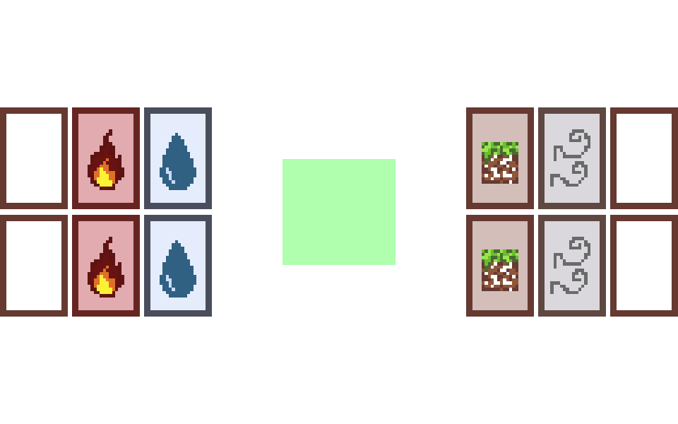

---
title: Trabalhe no Bruxó
subtitle: P6 - Apresentação Final
author: Rafaela Grillo & Theo Albuquerque & Yuri Sacksida
...

<!--
- em torno de 10 slides
- em torno de 10 minutos
- fazer demonstração do jogo

- [x] comparar expectativa inicial com o resultado final
- [ ] mostrar arquitetura geral
- [ ] mostrar 1 máquina de estados por participante
- [ ] mostrar trechos de código interessantes
-->

# Espectativas vs. Realidade

## Espectativas

- [ ] mecânicas básicas feitas:
    - [ ] mesclagem de cartas
    - [ ] diálogos visualizados com texto
    - [ ] diálogos visualizados com personagem
    - [ ] escolhas tomáveis com respostas nos diálogos
    - [ ] escolhas tomáveis com criação de poções nos diálogos
- [ ] conteúdo básico feito:
    - [ ] diálogo de 1 caso
    - [ ] artes
        - [ ] de cartas suficientes pras opções do primeiro caso
        - [ ] do fundo pra mesa
        - [ ] do fundo pra loja
        - [ ] dos personagens do caso
- [ ] extras:
    - [ ] animações ao arrastar as cartas
    - [ ] partículas ou efeito ao mesclar as cartas
    - [ ] "levantar" cartas ao segurar
    - [ ] expressões de personagens

## Realidade

- [ ] (90%) mecânicas básicas feitas:
    - [x] mesclagem de cartas
    - [x] diálogos visualizados com texto
    - [ ] diálogos visualizados com personagem
    - [x] escolhas tomáveis com respostas nos diálogos
    - [x] escolhas tomáveis com criação de poções nos diálogos
- [ ] (55%) conteúdo básico feito:
    - [ ] (60%) diálogo de 1 caso
    - [ ] artes
        - [x] de cartas suficientes pras opções do primeiro caso
        - [ ] (só tem o esboço) do fundo pra mesa
        - [ ] (só tem o esboço) do fundo pra loja
        - [ ] dos personagens do caso
- [ ] extras:
    - [x] (meio gambiarrada) linguagem e interpretador pros diálogos
    - [ ] animações ao arrastar as cartas
    - [ ] partículas ou efeito ao mesclar as cartas
    - [ ] "levantar" cartas ao segurar
    - [ ] expressões de personagens

# Estado do jogo

## Elementos


## Elementos



## Elementos

 +
 =


 +
 =


 +
 =


 +
 =


## Diálogos


## Diálogos


## Arte

Cada carta é feita com 2 sprites, um que é um fundo igual para todas as cartas e outro que é semi-transparente com a arte específica dos elementos.

\ 
\ 
\ 
\ 
\ 
\ 
\ 
\ 
\ 
\ 


# Demonstração

# Específicos

## Geral

O programa principal é uma máquina de estados de "telas".

Cada tela precisa fornecer 3 funções:
- `void [tela]_setup(renderer*)`
- `tela [tela]_loop(renderer*, event)`
- `void [tela]_free(void)`

No momento temos 3 telas:
- MENU
- MESA
- LOJA

## Geral

\small
```c
int main() { /* ... */
    enum tela tela = ZERO;
    uint32_t falta = TIMEOUT;
    for (SDL_Event evt; evt.type != SDL_QUIT; ) {
        AUX_NextEvent(&evt, &falta, TIMEOUT);

        enum tela prox;
        switch (tela) {
            case ZERO: prox = MENU; break;
            case MENU: prox = menu_loop(ren, evt); break;
            case MESA: prox = mesa_loop(ren, evt); break;
            case LOJA: prox = loja_loop(ren, evt); break;
        }

        /* ... */
        tela = prox;
    }
    /* ... */
}
```

## Geral

\small
```c
bool AUX_WaitEventTimeoutCount(SDL_Event* evt, uint32_t* ms) {
    static uint32_t antes;
    if (antes == 0) antes = SDL_GetTicks();

    bool evento = SDL_WaitEventTimeout(evt, *ms);
    if (evento) {
        uint32_t delta = DT(antes, &antes);
        *ms = (delta < *ms) ? *ms - delta : 0;
    }
    return evento;
}

bool AUX_WaitEventTimeout(SDL_Event* evt, uint32_t* ms,
                                          uint32_t timeout) {
    bool evento = AUX_WaitEventTimeoutCount(evt, ms);
    if (!evento) *ms = timeout;

    return evento;
}
```

## Geral

\small
```c
typedef enum {
    AUX_TIMEOUTEVENT = 0,
    AUX_SURECLICKEVENT,
    AUX_FIRSTUSEREVENT,
} AUX_EventType;

void AUX_FillTimeout(SDL_Event* evt) {
     evt->user = (SDL_UserEvent) {
         .type = SDL_USEREVENT,
         .code = AUX_TIMEOUTEVENT,
         .timestamp = SDL_GetTicks(),
     };
}

void AUX_NextEvent(SDL_Event* evt, uint32_t* falta,
                                   uint32_t timeout) {
    if (AUX_WaitEventTimeout(evt, falta, timeout));
    else AUX_FillTimeout(evt);
}
```

## Drag&Drop

```c
typedef enum drag_drop_state {
    UNCLICKED = 0,
    CLICKING,
    DRAGGING,

    DRAG_STATE_COUNT,
} DragDropState;

typedef struct drag_drop_rect {
    SDL_Rect r;

    DragDropState state;
    SDL_MouseButtonEvent click;
    SDL_Point offset;
} DragDropRect;
```

## Drag&Drop

\tiny
```c
#define asClick(evt) transmute(SDL_MouseButtonEvent, evt)
void AUX_DragDropCancel(DragDropRect* self, SDL_Event evt) {
    const bool clicked = (self->state == CLICKING) || (self->state == DRAGGING);
    switch (evt.type) {
      case SDL_KEYDOWN: switch (evt.key.keysym.sym) {
          case SDLK_ESCAPE: if (clicked) {
              self->r.x = self->click.x + self->offset.x;
              self->r.y = self->click.y + self->offset.y;

              self->state = UNCLICKED;
          } break;
      } break;
      case SDL_MOUSEBUTTONDOWN: {
          SDL_Point loc = { evt.button.x, evt.button.y };
          if (SDL_PointInRect(&loc, &self->r)) {
              self->offset.x = self->r.x - loc.x;
              self->offset.y = self->r.y - loc.y;
              self->click = asClick(evt);

              self->state = CLICKING;
          }
      } break;
      case SDL_MOUSEBUTTONUP: {
          if (self->state == CLICKING) AUX__EmitSureClick(self);

          self->state = UNCLICKED;
      } break;
      case SDL_MOUSEMOTION: if (clicked) {
          self->r.x = evt.button.x + self->offset.x;
          self->r.y = evt.button.y + self->offset.y;

          self->state = DRAGGING;
      } break;
    }
}
```

## Drag&Drop


## Geral

\small
```c
#define trans(prev, curr) \
        (((uint16_t)prev<<8) | ((uint16_t)curr))

#define prox_diff(prev, curr) \
        (((prev) != (curr)) ? curr : ZERO)
#define curr_diff(prev, curr) \
        (((prev) != (curr)) ? prev : ZERO)

#define maior(prev, curr) (prev>curr ? prev : curr)
#define menor(prev, curr) (prev<curr ? prev : curr)
#define par(prev, curr) \
        trans(menor(prev, curr), maior(prev, curr))
```

## Geral

\small
```c
enum tipo_carta combinar(const enum tipo_carta t1,
                         const enum tipo_carta t2) {
    switch (par(t1, t2)) {
        case par(CARTA_FOGO,  CARTA_AGUA): return CARTA_VAPOR;
        case par(CARTA_TERRA, CARTA_AGUA): return CARTA_LAMA;
        case par(CARTA_FOGO,  CARTA_AR):   return CARTA_SOM;

        case par(CARTA_LAMA,  CARTA_NADA): return POCAO_LAMA;
        case par(CARTA_SOM,   CARTA_NADA): return POCAO_SOM;

        default: return CARTA_NADA;
    }
}
```

## Mais eventos de usuário

\small
```c
void FillMergeEvent(SDL_Event* evt, struct carta* carta) {
     evt->user = (SDL_UserEvent) {
         .type = SDL_USEREVENT,
         .code = AUX_MERGEEVENT,
         .data1 = (void*)carta->tipo,
         .timestamp = SDL_GetTicks(),
     };
}

void EmitMergeEvent(struct carta* carta) {
    SDL_Event evt; FillMergeEvent(&evt, carta);
    SDL_PushEvent(&evt);
}
```

## Mesclagem de cartas

\small
```c
for (size_t i = num_cartas; i--; ) {
    AUX_DragDropCancel(&cartas[i].drag, evt);
    if (cartas[i].drag.state != UNCLICKED) {
        AUX_ToEndLen(cartas, num_cartas, i); break;
    }
}
```

## Mesclagem de cartas

\small
```c
struct carta* last = &cartas[num_cartas-1];
if (last->drag.state == UNCLICKED &&
    SDL_HasIntersection(&last->drag.r, &zona_fusao)) {
    for (size_t i = num_cartas-1; i--;) {
        const struct carta* curr = &cartas[i];
        if (!SDL_HasIntersection(&last->drag.r, &curr->drag.r)||
            !SDL_HasIntersection(&curr->drag.r, &zona_fusao))
            continue;

        struct carta n = fundir(*last, *curr);
        if (n.tipo == CARTA_NADA) continue;

        *last = n; AUX_RemoveUnordered(cartas, num_cartas, i);
        if (AUX_NullTerminatedFind(pocoes_possiveis, &n.tipo)) {
            EmitMergeEvent(&n); prox_tela = DIALOGO;
        }
        break;
    }
}
```

## etc

\small
```c
static inline
#define AUX_ToEnd(arr, i) \
        AUX_ToEndLen(arr, LEN(arr), i)
#define AUX_ToEndLen(arr, len, i) \
        AUX_ToEndSzLen(arr, sizeof(*arr), len, i)
void AUX_ToEndSzLen(void* arr, size_t size, size_t len, size_t idx) {
  #define elem(arr, size, idx) ((arr) + (size)*(idx))
    char *const base = arr;
    char *const curr = elem(base, size, idx);

    char buf[size];
    memcpy(buf, curr, size);

    char *const next = elem(base, size, idx+1);
    char *const last = elem(base, size, len-1);

    memmove(curr, next, last-curr);
    memcpy(last, buf, size);
  #undef elem
}

#define AUX_RemoveUnordered(arr, len, i) do { \
    AUX_ToEndLen(arr, len, i); len -= 1; \
} while(0)
```

## etc

\small
```c
static inline
#define AUX_Find(arr, needle) \
        AUX_FindLen(arr, LEN(arr), needle)
#define AUX_FindLen(arr, len, needle) \
        AUX_FindSzLen(arr, sizeof(*arr), len, needle)
void* AUX_FindSzLen(void* arr, size_t size, size_t len, void* needle) {
  #define elem(arr, size, idx) ((arr) + (size)*(idx))
    char *const base = arr;
    for (size_t i = 0; i < len; i++) {
        char *const curr = elem(base, size, i);
        if (memcmp(curr, needle, size) == 0) return curr;
    } return NULL;
  #undef elem
}
```

## etc

\small
```c
static inline
#define AUX_NullTerminatedLen(arr) \
        AUX_NullTerminatedLenSz(arr, sizeof(*arr))
size_t AUX_NullTerminatedLenSz(void* arr, size_t size) {
  #define elem(arr, size, idx) ((arr) + (size)*(idx))
    char zero[size]; memset(zero, 0, size);
    char *const base = arr;
    for (size_t i = 0;; i++) {
        char *const curr = elem(base, size, i);
        if (memcmp(curr, zero, size) == 0) return i;
    }
  #undef elem
}

#define AUX_NullTerminatedFind(arr, needle) \
        AUX_FindLen(arr, AUX_NullTerminatedLen(arr), needle)
```
