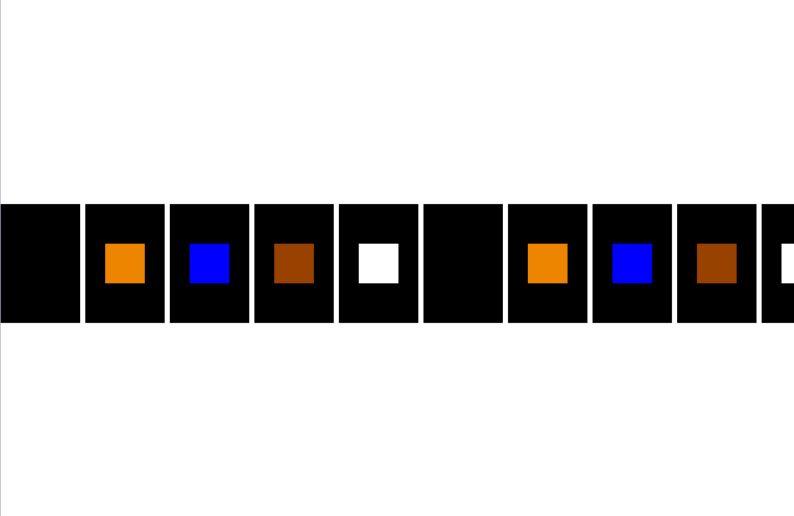
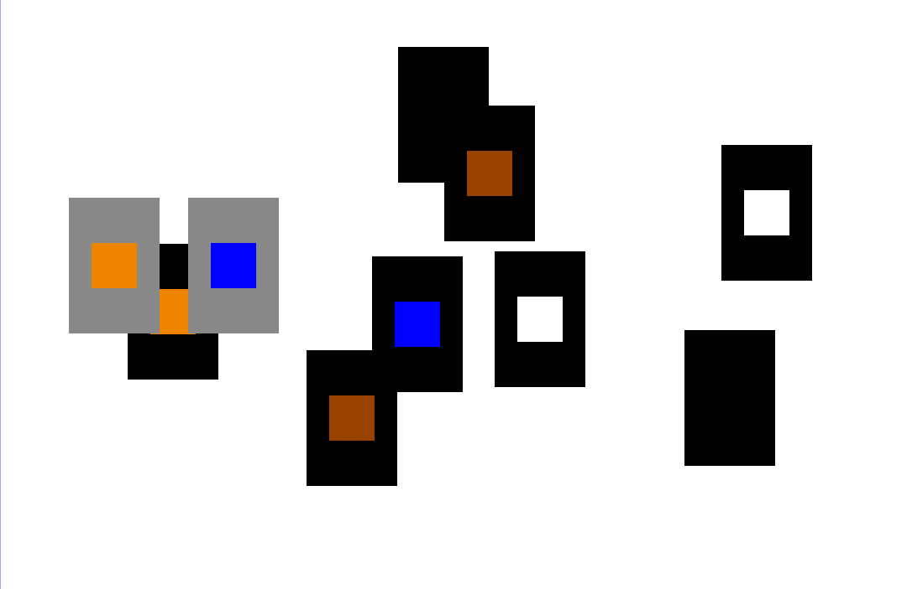
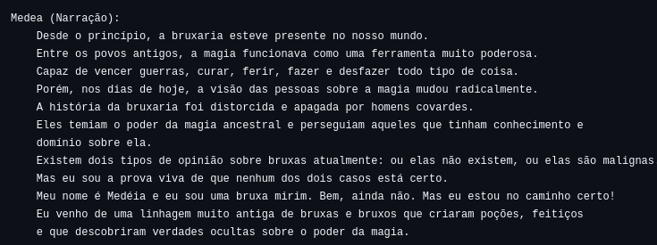
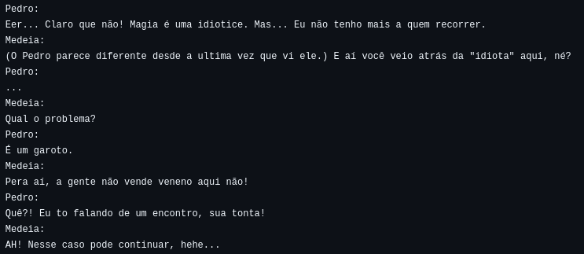
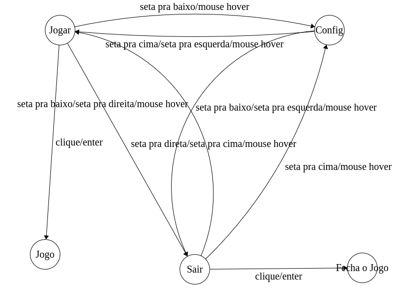

---
title: Trabalhe no Bruxó
subtitle: Avanços 2
author: Rafaela Grillo & Theo Albuquerque & Yuri Sacksida
...

# Estado do jogo

## Menu


## Elementos



## Elementos



## Diálogos

Da história central e de duas rotas que o jogador pode seguir.




A princípio o diálogo e rotas seriam estruturados por uma árvore encadeada, mas foi decidido que o texto será adaptado para Markdown e um parser o transformará nessa estrutura de dados (que o nosso programa interpretaria).

## Arte

Cada carta é feita com 2 sprites, um que é um fundo igual para todas as cartas e outro que é semi-transparente com a arte específica dos elementos.

As artes foram feitas no aseprite\*


\*(compilado na mão).

# Demonstração

# Específicos

## Geral

O programa principal é uma máquina de estados de "telas".

Cada tela precisa fornecer 3 funções:
- [tela]_setup(renderer\*)
- [tela]_loop(renderer\*, event)
- [tela]_free(void)

Internamente, cada tela teria um struct com o seu estado.\*

## Geral

Atualmente temos 2 telas:
- MENU
- MESA

## Geral

\small
```c
int main() { /* ... */
    enum tela tela = ZERO;
    uint32_t falta = TIMEOUT;
    for (SDL_Event evt; evt.type != SDL_QUIT; ) {
        AUX_NextEvent(&evt, &falta, TIMEOUT);
        enum tela prox;
        switch (tela) {
            case ZERO: prox = MENU; break;
            case MENU: prox = menu_loop(ren, evt); break;
            case MESA: prox = mesa_loop(ren, evt); break;
        }
        switch (prox_diff(tela, prox)) {
            case ZERO: break;
            case MENU: menu_setup(ren); break;
            case MESA: mesa_setup(ren); break;
        }
        /* ... */
        tela = prox;
    }
    /* ... */
}
```

## Geral

\small
```c
int main() { /* ... */
    enum tela tela = ZERO;
    uint32_t falta = TIMEOUT;
    for (SDL_Event evt; evt.type != SDL_QUIT; ) {
        AUX_NextEvent(&evt, &falta, TIMEOUT);
        /* ... */
        switch (curr_diff(tela, prox)) {
            case ZERO: break;
            case MENU: menu_free(); break;
            case MESA: mesa_free(); break;
        }
        switch (trans(tela, prox)) {
            case trans(MENU, ZERO): evt.type = SDL_QUIT; break;
        }
        /* ... */
    }
    /* ... */
}
```

## Menu

Cada botão no menu é um retângulo com um texto e algum tipo de saída.

```c
typedef struct {
    SDL_Rect box;
    char* label;
    union {
        intptr_t id, out;
        void* ptr;
    };
} AUX_Button;
```

Os botões são guardados numa lista e podem ser selecionados pelo mouse ou pelas setas do teclado.
A seleção, no código, é feita com um cursor que é um índice dessa lista.

## Menu

\small
```c
void AUX_DrawButton(SDL_Renderer* ren, AUX_Button bot,
                                       SDL_Color fundo,
                                       SDL_Color frente) {
    const SDL_Rect box = bot.box;
    const char* label = bot.label;
    const int tam = box.h*2/6;

    AUX_SetRenderDrawColor(ren, fundo);
    SDL_RenderFillRect(ren, &box);
    AUX_SetRenderDrawColor(ren, frente);

    SDL_Rect text_box = AUX_MeasureTextRects(label, tam);
                        AUX_CenterRect(&text_box, box);
    AUX_DrawTextRects(ren, label, tam, text_box.x, text_box.y);
}
```

## Menu



## Menu

\tiny
```c
void AUX_DrawTextRects(SDL_Renderer* ren, const char* texto, const int tam_fonte,
                                                             const int x, const int y) {
    /* ... */
    const struct SDL_Rect FONTE[][6] = {
        ['a'] = { TOP_H, MID_H,         ESQ_V,        DIR_V, },

        ['c'] = { TOP_H,        BOT_H,  ESQ_V,               },
        ['d'] = { TOP_H,        BOT_H,         MID_V, DIR_V, },
        ['e'] = { TOP_H, MID_H, BOT_H,  ESQ_V,               },
        ['f'] = { TOP_H, MID_H,         ESQ_V,               },

        ['h'] = {        MID_H,         ESQ_V,        DIR_V, },
        ['i'] = { TOP_H,        BOT_H,         MID_V,        },
        ['j'] = {               BOT_H,  DIR_V,               },

        ['l'] = {               BOT_H,  ESQ_V,               },
        ['m'] = { TOP_H,                ESQ_V, MID_V, DIR_V, },
        ['n'] = { TOP_H,                ESQ_V,        DIR_V, },
        ['o'] = { TOP_H,        BOT_H,  ESQ_V,        DIR_V, },

        ['t'] = { TOP_H,                       MID_V,        },
        ['u'] = {               BOT_H,  ESQ_V,        DIR_V, },

        ['w'] = {               BOT_H,  ESQ_V, MID_V, DIR_V, },
        ['x'] = {        MID_H,                MID_V,        }, //!
        /* ... */
    };

    for (size_t i = 0; texto[i]; i++) {
        const size_t c = tolower(texto[i]);
        AUX_DrawRectsAt(ren, FONTE[c], LEN(FONTE[c]), x+(tam_fonte+pad)*i, y);
    }
}
```

## Mesa

\tiny
```c
enum tela mesa_loop(SDL_Renderer* ren, SDL_Event evt) {
    /* ... */
    enum tela prox_tela = MESA;
    switch (evt.type) {
      case SDL_KEYUP: switch (evt.key.keysym.sym) {
          case SDLK_ESCAPE: prox_tela = MENU; break;
      } break;

      case SDL_USEREVENT: switch (evt.user.code) {
          case AUX_SURECLICKEVENT: {
              cartas[LEN(cartas)-1].cliques += 1;
          } break;

          case AUX_TIMEOUTEVENT: {
              AUX_RenderClearColor(ren, BRANCO);
              for (size_t i = 0; i < LEN(cartas); i++) {
                  const struct carta carta = cartas[i];
                  desenhar_carta(ren, carta);
              }

              SDL_RenderPresent(ren);
          } break;
      }
    }

    for (size_t i = LEN(cartas); i--; ) {
        AUX_DragDropCancel(&cartas[i].drag, evt);
        if (cartas[i].drag.state != UNCLICKED) {
            AUX_ToEnd(cartas, i); break;
        }
    }
    return prox_tela;
}
```

## Mesa (Cartas)

```c
enum tipo_carta {
    CARTA_NADA = 0,

    CARTA_FOGO,
    CARTA_AGUA,
    CARTA_TERRA,
    CARTA_AR,

    NUM_TIPOS_CARTA,
};

struct carta {
    DragDropRect drag;
    enum tipo_carta tipo;
    uint16_t cliques;
};
```

## Mesa (Cartas)

```c
typedef enum drag_drop_state {
    UNCLICKED = 0,
    CLICKING,
    DRAGGING,

    DRAG_STATE_COUNT,
} DragDropState;

typedef struct drag_drop_rect {
    SDL_Rect r;

    DragDropState state;
    SDL_MouseButtonEvent click;
    SDL_Point offset;
} DragDropRect;
```

## Mesa (Cartas)

\tiny
```c
#define asClick(evt) transmute(SDL_MouseButtonEvent, evt)
void AUX_DragDropCancel(DragDropRect* self, SDL_Event evt) {
    const bool clicked = (self->state == CLICKING) || (self->state == DRAGGING);
    switch (evt.type) {
      case SDL_KEYDOWN: switch (evt.key.keysym.sym) {
          case SDLK_ESCAPE: if (clicked) {
              self->r.x = self->click.x + self->offset.x;
              self->r.y = self->click.y + self->offset.y;

              self->state = UNCLICKED;
          } break;
      } break;
      case SDL_MOUSEBUTTONDOWN: {
          SDL_Point loc = { evt.button.x, evt.button.y };
          if (SDL_PointInRect(&loc, &self->r)) {
              self->offset.x = self->r.x - loc.x;
              self->offset.y = self->r.y - loc.y;
              self->click = asClick(evt);

              self->state = CLICKING;
          }
      } break;
      case SDL_MOUSEBUTTONUP: {
          if (self->state == CLICKING) AUX__EmitSureClick(self);

          self->state = UNCLICKED;
      } break;
      case SDL_MOUSEMOTION: if (clicked) {
          self->r.x = evt.button.x + self->offset.x;
          self->r.y = evt.button.y + self->offset.y;

          self->state = DRAGGING;
      } break;
    }
}
```

## Mesa (Cartas)


