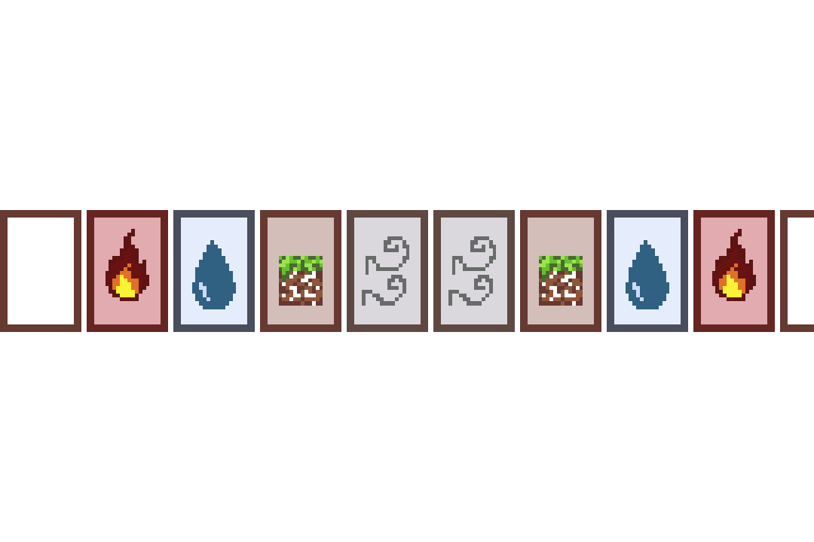
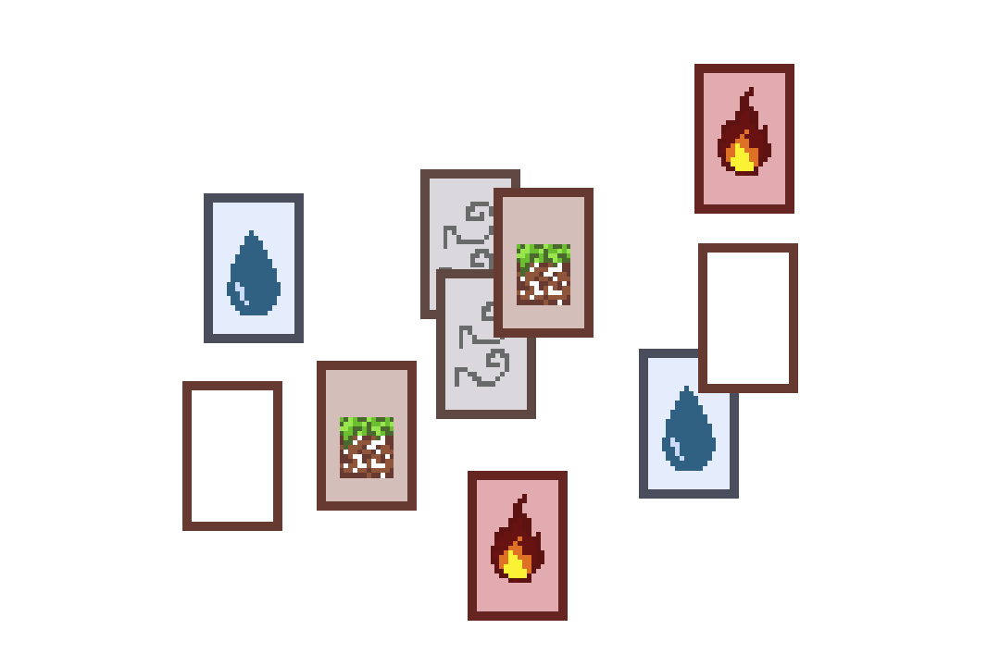
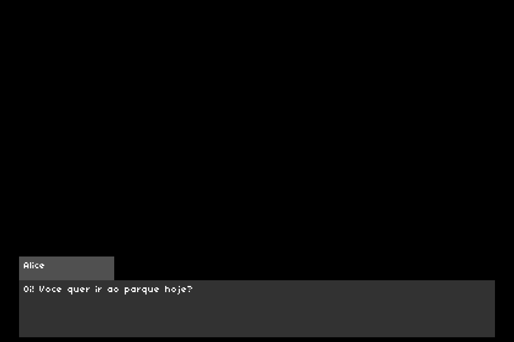
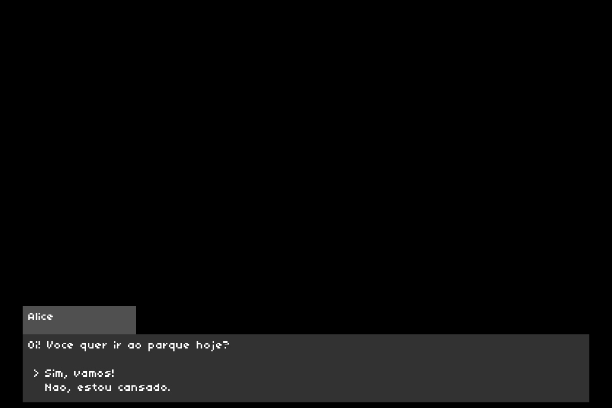

---
title: Trabalhe no Bruxó
subtitle: Avanços 3
author: Rafaela Grillo & Theo Albuquerque & Yuri Sacksida
...

# Estado do jogo

## Menu


## Elementos


## Elementos


## Diálogos ("frontend")


## Diálogos ("frontend")


## Diálogos ("frontend")


## Diálogos (interpretador)

Fizemos um tokenizador que consegue separar o markdown nos lexemas relevantes.


# Demonstração


# Específicos

## Diálogo (frontend)

```c
typedef struct dialog_node   DialogueNode;
typedef struct dialog_option DialogueOption;

struct dialog_option {
    char* text;
    DialogueNode* nextNode;
};

struct dialog_node {
    const char* speaker;
    const char* text;
    size_t num_opts;
    DialogueOption options[5];
    DialogueNode* next;
};
```

## Diálogo (frontend)

\scriptsize
```c
void loadDialogue() {
    DialogueNode* n1 = createNode("Alice", "Oi! Voce quer ir ao parque hoje?");
    DialogueNode* n2 = createNode("Alice", "Otimo! O dia esta lindo la fora.");
    DialogueNode* n3 = createNode("Alice", "Tudo bem, talvez outro dia.");

    n1->next = n2;

    n1->options[n1->num_opts++] = (DialogueOption){"Sim, vamos!", n2};
    n1->options[n1->num_opts++] = (DialogueOption){"Nao, estou cansado.", n3};

    dialogo.head = n1;
    dialogo.current = n1;
}
```


## Diálogo (frontend)

\scriptsize
```c
void renderDialog(SDL_Renderer* ren, TTF_Font* font) {
    DialogueNode* node = dialogo.current;
    SDL_Rect nameBox = { TAM_FONTE*2, W_WIDTH/2,
                         TAM_FONTE*10, TAM_FONTE*2 + TAM_FONTE/2 };
    SDL_Rect textBox = { TAM_FONTE*2, nameBox.y + nameBox.h,
                         W_WIDTH - (TAM_FONTE*4), TAM_FONTE*6 };

    SDL_SetRenderDrawColor(ren,50,50,50,255); SDL_RenderFillRect(ren,&textBox);
    SDL_SetRenderDrawColor(ren,80,80,80,255); SDL_RenderFillRect(ren,&nameBox);

    renderText(ren, font, node->speaker, nameBox.x + 10, nameBox.y + 10);
    renderText(ren, font, node->text,    textBox.x + 10, textBox.y + 10);

    if (dialogo.waiting_for_choice) {
        for (size_t i = 0; i < node->num_opts; ++i) {
            const char* prefix = (i == dialogo.selected_option ? "> " : "  ");
            renderText(ren, font, prefix,
                       textBox.x + TAM_FONTE,
                       textBox.y + TAM_FONTE*3 + i*(TAM_FONTE+5));
            renderText(ren, font, node->options[i].text,
                       textBox.x + TAM_FONTE*2,
                       textBox.y + TAM_FONTE*3 + i*(TAM_FONTE+5));
        }
    }
}
```

## Diálogo (frontend)

\scriptsize
```c
enum tela dialogo_loop(SDL_Renderer* ren, SDL_Event evt) {
  const DialogueNode* node = dialogo.current;
  switch (evt.type) {
    case SDL_KEYDOWN: switch (evt.key.keysym.sym) {
      case SDLK_ESCAPE: return MENU;

      case SDLK_SPACE: case SDLK_RETURN: {
        if (dialogo.waiting_for_choice) {
          if (dialogo.selected_option < node->num_opts) {
            dialogo.current = node->options[dialogo.selected_option].nextNode;
            dialogo.waiting_for_choice = false;
          }
        } else {
          if (node->num_opts > 0) {
            dialogo.waiting_for_choice = true;
          } else if (node->next) {
            dialogo.current = node->next;
          }
        }
      } break;
      /* ... */
    } break;
    /* ... */
  }
  return DIALOGO;
}
```

## Diálogo (frontend)

\scriptsize
```c
enum tela dialogo_loop(SDL_Renderer* ren, SDL_Event evt) {
    const DialogueNode* node = dialogo.current;

    switch (evt.type) {
      case SDL_KEYDOWN: switch (evt.key.keysym.sym) {
          /* ... */
          case SDLK_UP: if (dialogo.waiting_for_choice) {
              dialogo.selected_option =
              (dialogo.selected_option - 1 + node->num_opts) % node->num_opts;
          } break;

          case SDLK_DOWN: if (dialogo.waiting_for_choice) {
              dialogo.selected_option =
              (dialogo.selected_option + 1) % node->num_opts;
          } break;
      } break;
    }
    /* ... */
}
```

## Diálogo (frontend)

\small
```c
enum tela dialogo_loop(SDL_Renderer* ren, SDL_Event evt) {
    /* ... */
    switch (evt.type) {
      /* ... */
      case SDL_USEREVENT: switch (evt.user.code) {
          case AUX_TIMEOUTEVENT: {
              AUX_RenderClearColor(ren, PRETO);
              renderDialog(ren, dialogo.font);
              SDL_RenderPresent(ren);
          } break;
      } break;
    }
    /* ... */
}
```

## Diálogo (interpretador)

```c
struct lexer {
    char* buf;
    size_t len;
    size_t idx;
    char curr;
    char next;

    const char* file_name;
    size_t line;
    size_t col;
};
```

## Diálogo (interpretador)

\small
```c
enum token_kind {
    ABRE_TITULO = '#',
    FECHA_NOME  = ':',
    ABRE_FALA   = '-',
    ABRE_CITACAO= '>',
    ABRE_COL    = '[',
    FECHA_COL   = ']',
    ABRE_PAR    = '(',
    FECHA_PAR   = ')',
    FECHA_LINHA = '\n',

    TEXTO = 256,
    INDENTACAO,
    TOK_EOF,
};
```

## Diálogo (interpretador)

```c
struct token_t {
    enum token_kind kind;
    size_t idx, len, line, col;
};
```

## Diálogo (interpretador)

\scriptsize
```c
struct token_t lexer_next(struct lexer* l) {
    struct lexer start = *l; char c = l->curr;
    switch (c) {
        case '\0': return lexer__make_token(&start, &start, TOK_EOF);

        case '#': case ':': case '-': case '>':
        case '[': case ']': case '(': case ')': case '\n': {
            lexer__advance(l);
            return lexer__make_token(&start, &start, (enum token_kind)c);
        } break;
        /* ... */
        case ' ': case '\t': {
            while (lexer__is_whitespace(l->next)) lexer__advance(l);
            struct lexer end = *l; lexer__advance(l);
            if (start.col != 0) return lexer_next(l);

            return lexer__make_token(&start, &end, INDENTACAO);
        } break;

        default: {
            while (!lexer__is_simple_token(l->next)) lexer__advance(l);
            struct lexer end = *l; lexer__advance(l);
            return lexer__make_token(&start, &end, TEXTO);
        } break;
    }
}
```
